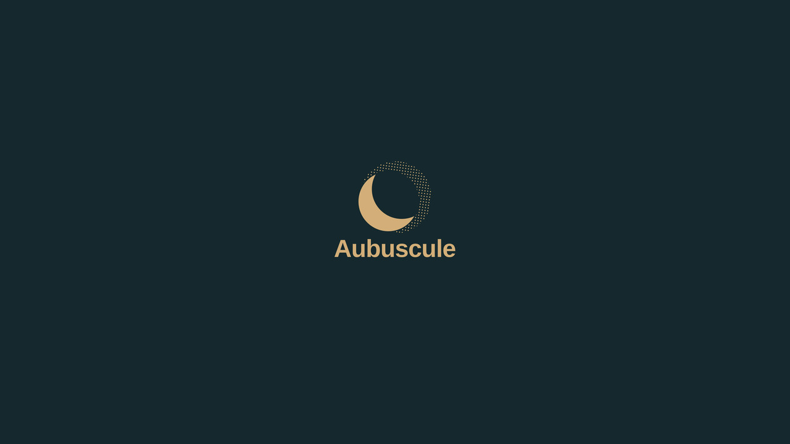

<div align="center">
  
  
  # ✦ DOTFILES ✦
  
  **A highly optimized, declarative, cross-platform environment powered entirely by `mise`.**
</div>

---

## 🏗️ Architecture

This repository has been fully modernized. All legacy Bash scripts and convoluted Homebrew wrappers have been eliminated. The entire ecosystem is strictly declarative and managed universally by [mise](https://mise.jdx.dev/).

The configuration is cleanly split across three files:

1. **`mise.toml`** (The Core Base)
   - Universal language runtimes (`python`, `node`, `ruby`, `go`, `rust`).
   - Package managers (`yarn`, `pnpm`, `uv`, `pipx`).
   - Cross-platform, natively compiled CLIs (`gh`, `fzf`, `ripgrep`, `fd`, `jq`, `lazygit`, `starship`, `eza`, `direnv`, `yq`, `awscli`).
   - All dotfile symlink mappings (git configs, zsh, nvim, opencode, gemini, etc.).

2. **`mise.macos.toml`** (macOS Environment)
   - Heavy GUI Casks (`discord`, `figma`, `chrome`, `obsidian`, `vlc`).
   - System-bound Brew formulas requiring macOS dynamic libraries or C compilation (`ffmpeg`, `cmake`, `git`).

3. **`mise.omarchy.toml`** (Omarchy Desktop Environment)
   - Desktop apps, `pacman` dependencies (`zsh`, `tmux`), and Bépo tasks.

4. **`mise.ubuntu.toml`** (Ubuntu Headless Environment)
   - Minimal server setup using `apt` dependencies (`zsh`, `tmux`, `git`).

---

## ⌨️ Keyboard Layout (Bépo)

If you use the Bépo keyboard layout, a cross-platform setup task is included. It automatically downloads the macOS `.bundle` drivers, sets up Omarchy/Hyprland runtime variables, and applies Linux `localectl` configurations natively:
```bash
mise -E <os> run setup-bepo
```

---

## 🚀 Installation

Because `mise` handles everything (including dotfile symlinking), bootstrapping a brand new machine is incredibly simple. 

### Prerequisites
First, install `mise` using their standalone script (this works anywhere):
```bash
curl https://mise.run | sh
~/.local/bin/mise --version
```
*(Make sure to follow the shell activation prompt if it's your first time!)*

Clone the repository to your home directory:
```bash
git clone https://github.com/mihaliak/dotfiles.git ~/Projects/dotfiles
```

### 🍎 macOS Setup
Navigate to the directory and tell `mise` to bootstrap the `macos` environment:
```bash
cd ~/Projects/dotfiles
mise -E macos bootstrap --yes
```

### 🐧 Desktop Linux (Omarchy) Setup
Navigate to the directory and tell `mise` to bootstrap the `omarchy` environment:
```bash
cd ~/Projects/dotfiles
mise -E omarchy bootstrap --yes
```

### 🖥️ Headless Server (Ubuntu) Setup
Navigate to the directory and tell `mise` to bootstrap the `ubuntu` environment:
```bash
cd ~/Projects/dotfiles
mise -E ubuntu bootstrap --yes
```

---

## 🌌 Omarchy / Desktop Configuration

If you are running the **Omarchy** tiling window manager environment on Linux (Hyprland, Waybar, Foot, etc.), your UI configs are automatically symlinked via `mise.toml` if they are in the `dots/` directory.

### Quick Tips for Omarchy:
- **Wallpaper / Aesthetics**: Handled natively by the dotfiles config. 
- **Window Rules / Keybinds**: Edit the corresponding `~/.config/hypr/` or `~/.config/omarchy/` symlinks.
- **Reloading**: Simply restart your window manager or use the built-in Omarchy reload keybinding after bootstrapping to apply the new GTK and layout themes.

---

## 🛠️ Maintenance & Updating

You no longer need to run custom `backup` or `clean` scripts. 

- To update all language tools and binaries across your system:
  ```bash
  mise up
  ```
- To update your environment after pulling new dotfiles commits:
  ```bash
  mise dotfiles apply
  ```
- To safely test what a bootstrap *would* do without changing anything:
  ```bash
  mise -E <os> bootstrap plan
  ```

---
*Powered by Google Antigravity & `mise`*
